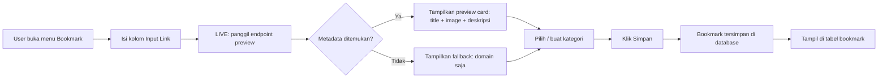
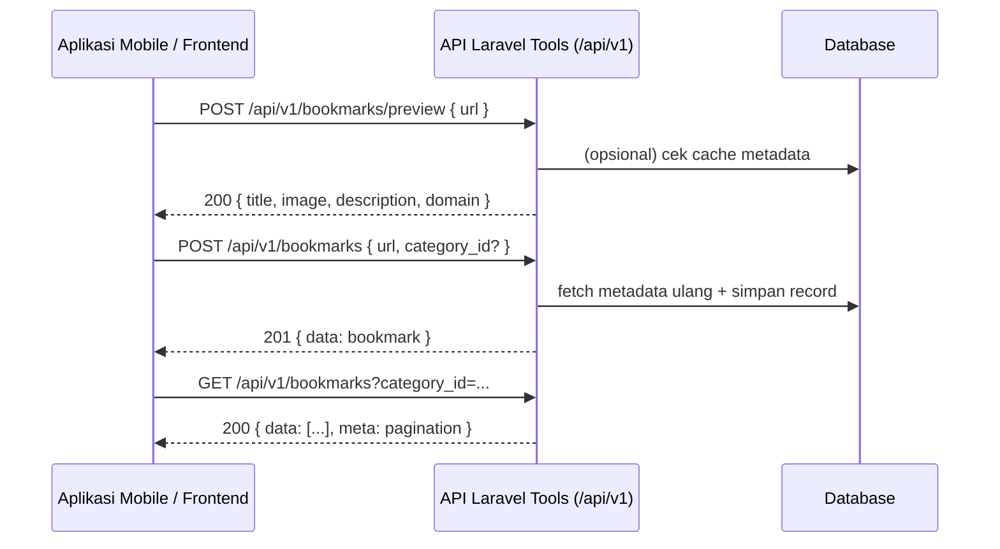
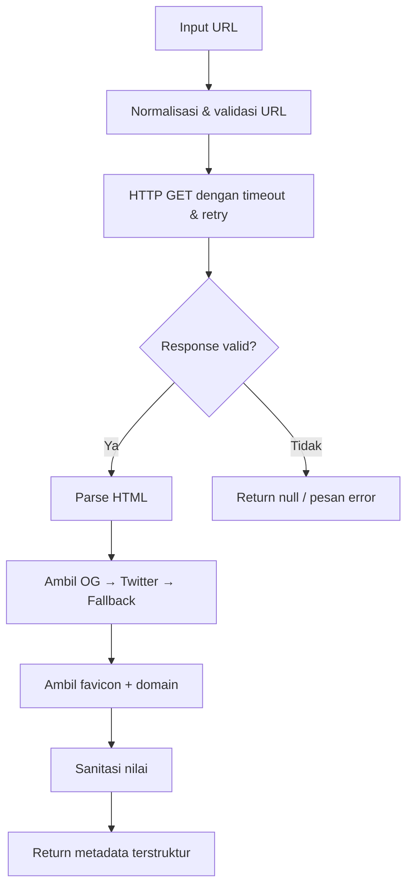

# Dokumentasi Fitur Bookmark

> Panduan lengkap fitur **Bookmark** pada **Laravel Tools** — modul untuk menyimpan tautan (link) beserta metadata otomatis (title, gambar OG, deskripsi), dikelompokkan dalam kategori yang dinamis, serta dapat diakses dari aplikasi frontend lain (misal aplikasi mobile) melalui REST API.

**Status**: Tersedia (sudah diimplementasikan)
**Versi API**: `v1`
**Dokumen ini ditujukan untuk**: developer frontend / mobile / Laravel project lain yang ingin berintegrasi.

---

## Daftar Isi

1. [Ringkasan](#1-ringkasan)
2. [Alur Kerja](#2-alur-kerja)
3. [Struktur Database](#3-struktur-database)
4. [Link Preview (Metadata Extraction)](#4-link-preview-metadata-extraction)
5. [Autentikasi API](#5-autentikasi-api)
6. [Endpoint API](#6-endpoint-api)
7. [Format Response](#7-format-response)
8. [Pagination & Filter](#8-pagination--filter)
9. [Error Handling](#9-error-handling)
10. [Contoh Integrasi](#10-contoh-integrasi)
11. [Pedoman Penggunaan dari Frontend](#11-pedoman-penggunaan-dari-frontend)
12. [Catatan Keamanan & Limitasi](#12-catatan-keamanan--limitasi)

---

## 1. Ringkasan

Fitur Bookmark memungkinkan pengguna:

- Menyimpan tautan dari internet maupun media sosial ke dalam sebuah koleksi pribadi.
- Setiap tautan otomatis menangkap **title**, **image (Open Graph)**, dan **deskripsi** dari halaman sumber — perilaku yang sama seperti saat menempelkan tautan di Facebook atau WhatsApp (link preview / unfurl).
- Mengorganisir tautan ke dalam **kategori** yang dapat dibuat dan dihapus secara dinamis.
- Mengakses data melalui **REST API** (`/api/v1/bookmarks`) sehingga dapat dikonsumsi oleh aplikasi mobile maupun frontend lain.

### Modul pada dashboard

- Lokasi menu: **Modules → Internet → Bookmark**
- Halaman menampilkan tabel berisi: link, title, image (OG), deskripsi, dan kategori.
- Form input link dengan **preview otomatis** sebelum disimpan.

> **Dependency terpasang**: `laravel/sanctum` untuk token API. API routes sudah didaftarkan di `bootstrap/app.php` (`routes/api.php`).

### Komponen utama

| Komponen | Lokasi |
|---|---|
| Service metadata / link preview | `app/Services/Internet/BookmarkPreviewService.php` |
| Service bisnis Bookmark | `app/Services/Internet/BookmarkService.php` |
| Livewire component + view | `app/Livewire/Internet/BookmarkIndex.php` & `resources/views/livewire/internet/bookmark.blade.php` |
| Controller API | `app/Http/Controllers/Api/V1/BookmarkController.php` |
| Route API | `routes/api.php` |
| Model | `app/Models/Bookmark.php`, `app/Models/BookmarkCategory.php` |
| Test | `tests/Feature/Bookmark/` |

---

## 2. Alur Kerja

### 2.1 Alur dari dashboard (Livewire)



Detail langkah:

1. User membuka **Modules → Internet → Bookmark**.
2. User menempelkan URL pada kolom **Input Link**.
3. Sistem melakukan **debounce** (± 800 ms) lalu memanggil proses **metadata extraction**.
4. Metadata (title, image OG, deskripsi) diambil dari halaman sumber dan ditampilkan sebagai **preview card** di bawah input (tidak perlu klik tombol).
5. User dapat memilih kategori yang sudah ada, atau membuat kategori baru secara dinamis.
6. User menekan **Simpan** — data tersimpan; `image_url` mengacu langsung ke gambar di server sumber (unduh lokal ke `image_path` belum diimplementasikan).
7. Data tampil pada tabel bookmark dengan opsi **cari**, **filter kategori**, dan **hapus**.

### 2.2 Alur dari aplikasi eksternal (API)



---

## 3. Struktur Database

### 3.1 Tabel `bookmarks`

Menyimpan satu tautan beserta metadata hasil extraction.

| Kolom | Tipe | Deskripsi |
|---|---|---|
| `id` | bigint (PK, auto) | ID unik |
| `user_id` | bigint FK → `users.id` | Pemilik bookmark |
| `category_id` | bigint FK → `bookmark_categories.id` (nullable) | Kategori; `null` = Uncategorized |
| `url` | string(2048) | URL lengkap sumber |
| `title` | string(500) | Judul halaman |
| `description` | text (nullable) | Deskripsi / og:description (opsional) |
| `image_url` | string(2048) (nullable) | URL gambar Open Graph |
| `image_path` | string(255) (nullable) | Path lokal jika gambar diunduh |
| `favicon_url` | string(2048) (nullable) | URL favicon situs |
| `domain` | string(255) | Nama domain sumber (mis. `youtube.com`) |
| `metadata` | json (nullable) | Raw metadata lengkap (OG, Twitter, dsb.) |
| `is_active` | boolean (default: true) | Soft on/off tanpa menghapus record |
| `visited_count` | unsignedInteger (default: 0) | Jumlah kali dibuka |
| `last_visited_at` | timestamp (nullable) | Waktu terakhir dibuka |
| `created_at` / `updated_at` | timestamp | Timestamp standar |
| `deleted_at` | timestamp (nullable) | Soft delete |

**Indeks**: `user_id`, `category_id`, `domain`, gabungan `(user_id, category_id)`.

### 3.2 Tabel `bookmark_categories`

Menyimpan kategori tautan. Kategori bersifat **dinamis** (bisa ditambah/hapus dari UI maupun API).

| Kolom | Tipe | Deskripsi |
|---|---|---|
| `id` | bigint (PK, auto) | ID unik |
| `user_id` | bigint FK → `users.id` | Pemilik kategori |
| `name` | string(100) | Nama kategori (mis. "Coding", "Berita") |
| `slug` | string(100) | Slug unik per user (mis. `coding`) |
| `color` | string(20) (nullable) | Warna label (hex, mis. `#10b981`) |
| `sort_order` | unsignedInteger (default: 0) | Urutan tampil |
| `created_at` / `updated_at` | timestamp | Timestamp standar |

**Indeks**: `user_id`, `(user_id, slug)` unik.

> **Perilaku hapus kategori**: bookmark dengan kategori yang dihapus dipindah ke `category_id = NULL` (Uncategorized). Hapus **hard delete** bila tidak ada bookmark, atau **soft reference** bila ada — finalisasi saat implementasi.

### 3.3 Relasi

```
User (1) ──── (N) Bookmark (N) ──── (1) BookmarkCategory (N) ──── (1) User
```

---

## 4. Link Preview (Metadata Extraction)

Fungsi ini meniru perilaku link preview Facebook/WhatsApp: diberikan satu URL, sistem mengambil metadata dari halaman tersebut.

### 4.1 Sumber metadata (prioritas)

1. **Open Graph** — `<meta property="og:title">`, `og:image`, `og:description`, `og:site_name`.
2. **Twitter Cards** — `<meta name="twitter:title">`, `twitter:image`, `twitter:description`.
3. **Fallback HTML** — `<title>`, `<meta name="description">`, `<link rel="image_src">`.
4. **Favicon** — `<link rel="icon" / shortcut icon>`.
5. **JSON-LD** (opsional) — `application/ld+json` untuk struktur data kaya.

### 4.2 Proses



1. **Validasi URL**: skema `http://` / `https://` wajib; bila tidak ada skema, otomatis ditambahkan `https://`. Skema selain http/https ditolak.
2. **Fetch halaman**: `Http` facade dengan:
   - timeout 10 detik, retry 2× (500 ms);
   - `User-Agent` browser (agar situs yang memblokir bot tetap merespons);
   - redirect sampai 5 hop, TLS verify dinonaktifkan.
3. **Parse HTML**: ekstrak `<meta>` tags dengan regex (tanpa dependensi eksternal).
4. **Sanitasi**: buang tag HTML dari title/description (`strip_tags`); batasi panjang (title ≤ 500, description ≤ 1000).
5. **Output** terstruktur:

```json
{
    "url": "https://example.com/artikel",
    "domain": "example.com",
    "title": "Judul Artikel",
    "description": "Ringkasan artikel...",
    "image_url": "https://example.com/cover.jpg",
    "favicon_url": "https://example.com/favicon.ico",
    "site_name": "Example",
    "fetched_at": "2026-08-15T12:00:00Z"
}
```

### 4.3 Caching metadata

- Metadata hasil extraction **belum** di-cache pada implementasi saat ini — setiap `preview` / save melakukan HTTP request ulang.
- Image OG **belum** diunduh ke storage lokal pada implementasi saat ini; kolom `image_path` tetap `null` dan UI memakai `image_url` langsung.

### 4.4 Edge cases

| Kondisi | Penanganan |
|---|---|
| URL tanpa metadata | Simpan URL, title fallback = domain, image = null |
| URL tanpa skema (mis. `example.com`) | Otomatis ditambahkan `https://` |
| URL redirect | Ikuti redirect sampai max 5 hop |
| HTTP 403 / diblokir bot | `preview` gagal → `422`; saat simpan, sistem mencoba fetch dan bila gagal tetap menyimpan dengan metadata dari fetch |
| Timeout / DNS gagal | `preview` → `422`; saat simpan, URL tetap disimpan namun title/deskripsi mengikuti nilai yang dikirim |
| `og:image` bukan URL absolut | Resolve terhadap base URL halaman |
| Konten tidak HTML (PDF, image, dll.) | Title/description = null (karena tidak ada meta tag) |
| XSS pada metadata | Sanitasi semua string (strip_tags); sertakan sebagai teks biasa, bukan HTML mentah |

---

## 5. Autentikasi API

Karena aplikasi ini **internal, dipakai 1 user saja**, autentikasi dibuat sesederhana mungkin namun tetap aman untuk melindungi data dari akses luar:

- **Metode**: Laravel **Sanctum** Personal Access Token.
- **Header**:

```
Authorization: Bearer <personal_access_token>
Accept: application/json
```

- Token dibuat dari dashboard (halaman Settings → API Tokens) atau via `php artisan tinker`.
- Response data tetap discope `user_id` dari token (tidak perlu auth per-role/permission yang rumit).

### Contoh membuat token

```php
// Laravel / Tinker
$user = \App\Models\User::first();
$token = $user->createToken('mobile-app')->plainTextToken;
echo $token;
```

### Contoh response tanpa token

```json
{
    "message": "Unauthenticated.",
    "errors": {}
}
```

---

## 6. Endpoint API

Base URL:

```
https://your-domain.com/api/v1
```

Semua endpoint di bawah wajib header `Authorization: Bearer <token>`.

### 6.1 Bookmark

#### `GET /api/v1/bookmarks`

List bookmark milik user terautentikasi, terurut `created_at` desc.

**Query params**:

| Param | Tipe | Default | Deskripsi |
|---|---|---|---|
| `per_page` | int | 20 | Jumlah per halaman (max 100) |
| `page` | int | 1 | Nomor halaman |
| `search` | string | - | Cari di `title`, `description`, `url`, `domain` |
| `category_id` | int | - | Filter berdasarkan kategori (null = Uncategorized) |
| `sort_by` | string | `created_at` | `created_at`, `title`, `domain`, `visited_count` |
| `sort_dir` | string | `desc` | `asc` / `desc` |

**Response `200`**:

```json
{
    "data": [
        {
            "id": 12,
            "url": "https://laravel.com/docs",
            "title": "Laravel Documentation",
            "description": "The official Laravel documentation.",
            "image_url": "https://laravel.com/img/og-image.png",
            "image_path": null,
            "favicon_url": "https://laravel.com/favicon.ico",
            "domain": "laravel.com",
            "category": {
                "id": 3,
                "name": "Coding",
                "color": "#10b981"
            },
            "visited_count": 0,
            "last_visited_at": null,
            "created_at": "2026-08-15T12:00:00.000000Z"
        }
    ],
    "links": {
        "first": "https://your-domain.com/api/v1/bookmarks?page=1",
        "last": "https://your-domain.com/api/v1/bookmarks?page=3",
        "prev": null,
        "next": "https://your-domain.com/api/v1/bookmarks?page=2"
    },
    "meta": {
        "current_page": 1,
        "from": 1,
        "last_page": 3,
        "per_page": 20,
        "to": 20,
        "total": 57
    }
}
```

#### `POST /api/v1/bookmarks`

Simpan bookmark baru. Metadata otomatis di-fetch dari `url`.

**Body**:

```json
{
    "url": "https://github.com/",
    "category_id": 3,
    "title": "Judul custom (opsional, menimpa hasil fetch)",
    "description": "Deskripsi custom (opsional, menimpa hasil fetch)"
}
```

**Aturan validasi**:

| Field | Rule |
|---|---|
| `url` | `required`, `string`, `max:2048` |
| `category_id` | `nullable`, `integer`, `exists:bookmark_categories,id` **milik user** |
| `title` | `nullable`, `string`, `max:500` |
| `description` | `nullable`, `string`, `max:1000` |

**Response `201`** — body sama dengan shape item `data` pada GET, dengan `metadata` sumber:

```json
{
    "data": {
        "id": 13,
        "url": "https://github.com/",
        "title": "GitHub: Let's build from here",
        "description": "GitHub is where over 100 million developers shape the future...",
        "image_url": "https://github.githubassets.com/assets/campaign-social.png",
        "image_path": null,
        "favicon_url": "https://github.com/favicon.ico",
        "domain": "github.com",
        "category": {
            "id": 3,
            "name": "Coding",
            "color": "#10b981"
        },
        "visited_count": 0,
        "last_visited_at": null,
        "created_at": "2026-08-15T12:05:00.000000Z"
    }
}
```

> Jika URL sudah pernah disimpan oleh user yang sama → `409 Conflict` dengan pesan `URL sudah ada di bookmark`.

#### `GET /api/v1/bookmarks/{id}`

Detail satu bookmark.

- `200` dengan shape `data` seperti di atas.
- `404` jika tidak ditemukan / bukan milik user.

#### `PUT/PATCH /api/v1/bookmarks/{id}`

Perbarui bookmark.

**Body (partial)**:

```json
{
    "title": "Judul baru",
    "description": "Deskripsi baru",
    "category_id": 5,
    "url": "https://domain-baru.com/"
}
```

- `url` jika diubah → sistem **refetch metadata**.
- `category_id` boleh `null` untuk memindah ke Uncategorized.
- `title` dan `description` boleh kosong untuk mengembalikan ke hasil fetch.
- Response `200` dengan shape `data`.

#### `DELETE /api/v1/bookmarks/{id}`

Hapus bookmark (**soft delete**).

- `204 No Content` pada sukses.
- `404` jika tidak ditemukan / bukan milik user.
- Gambar lokal (`image_path`) ikut dihapus dari storage.

#### `POST /api/v1/bookmarks/preview`

**Tanpa menyimpan** — ambil metadata untuk ditampilkan sebagai preview di frontend (sebelum user menyimpan). Endpoint ini yang dipakai dashboard dan aplikasi mobile untuk kartu preview.

**Body**:

```json
{
    "url": "https://www.youtube.com/watch?v=abc123"
}
```

**Response `200`**:

```json
{
    "data": {
        "url": "https://www.youtube.com/watch?v=abc123",
        "domain": "youtube.com",
        "title": "Contoh Video YouTube",
        "description": "Deskripsi video...",
        "image_url": "https://i.ytimg.com/vi/abc123/maxresdefault.jpg",
        "favicon_url": "https://www.youtube.com/favicon.ico",
        "site_name": "YouTube",
        "already_saved": false,
        "fetched_at": "2026-08-15T12:10:00.000000Z"
    }
}
```

Field `already_saved` menunjukkan apakah URL sudah tersimpan oleh user (agar frontend bisa menampilkan peringatan duplikat).

### 6.2 Kategori (Bookmark Categories)

#### `GET /api/v1/bookmark-categories`

List kategori milik user, terurut `sort_order` asc.

**Response `200`**:

```json
{
    "data": [
        {
            "id": 1,
            "name": "Coding",
            "slug": "coding",
            "color": "#10b981",
            "sort_order": 0,
            "bookmarks_count": 12
        },
        {
            "id": 2,
            "name": "Berita",
            "slug": "berita",
            "color": "#f59e0b",
            "sort_order": 1,
            "bookmarks_count": 5
        }
    ]
}
```

#### `POST /api/v1/bookmark-categories`

Buat kategori baru.

```json
{
    "name": "Desain",
    "color": "#8b5cf6"
}
```

Validasi: `name` required, string, max 100, unik per user; `color` nullable, regex hex `#RRGGBB`.

**Response `201`** dengan shape `data` kategori (tanpa `bookmarks_count`).

#### `PUT/PATCH /api/v1/bookmark-categories/{id}`

Perbarui nama/warna/urutan.

```json
{
    "name": "Desain Grafis",
    "color": "#8b5cf6",
    "sort_order": 2
}
```

**Response `200`**.

#### `DELETE /api/v1/bookmark-categories/{id}`

Hapus kategori. Bookmark di dalamnya menjadi **Uncategorized** (`category_id = null`).

- `204 No Content`.
- `404` jika tidak ditemukan / bukan milik user.

### 6.3 Ringkasan endpoint

| Method | Endpoint | Deskripsi |
|---|---|---|
| GET | `/api/v1/bookmarks` | List + filter + pagination |
| POST | `/api/v1/bookmarks` | Simpan bookmark (auto-fetch metadata) |
| GET | `/api/v1/bookmarks/{id}` | Detail bookmark |
| PUT / PATCH | `/api/v1/bookmarks/{id}` | Perbarui bookmark |
| DELETE | `/api/v1/bookmarks/{id}` | Hapus bookmark |
| POST | `/api/v1/bookmarks/preview` | Preview metadata tanpa simpan |
| GET | `/api/v1/bookmark-categories` | List kategori |
| POST | `/api/v1/bookmark-categories` | Buat kategori |
| PUT / PATCH | `/api/v1/bookmark-categories/{id}` | Perbarui kategori |
| DELETE | `/api/v1/bookmark-categories/{id}` | Hapus kategori |

---

## 7. Format Response

Seluruh response API mengikuti struktur JSON:

- **Sukses**: `{ "data": ... }` — objek tunggal atau array item, diikuti `links` + `meta` untuk list yang di-paginate.
- **Error**: `{ "message": "...", "errors": { field: ["..."] } }`.

### Kode status

| Kode | Arti |
|---|---|
| 200 | OK |
| 201 | Resource berhasil dibuat |
| 204 | Sukses tanpa konten (DELETE) |
| 401 | Token tidak valid / kadaluarsa |
| 404 | Resource tidak ditemukan / bukan milik user |
| 409 | Konflik (URL duplikat, URL tidak valid saat simpan) |
| 422 | Validasi gagal / metadata gagal di-fetch (preview) |
| 429 | Rate limit terlampaui |
| 500 | Error server |

### Contoh error validasi `422`

```json
{
    "message": "URL tidak valid.",
    "errors": {
        "url": [
            "Field url harus berupa URL yang valid."
        ]
    }
}
```

---

## 8. Pagination & Filter

- Pagination menggunakan format **Laravel LengthAwarePaginator** (`data`, `links`, `meta`).
- Filter `search` melakukan `LIKE` pada `title`, `description`, `url`, `domain`.
- Filter `category_id=null` (string literal) untuk mendapatkan bookmark **tanpa kategori**.

Contoh request:

```http
GET /api/v1/bookmarks?search=laravel&category_id=3&per_page=10&page=2
GET /api/v1/bookmarks?category_id=null
```

---

## 9. Error Handling

| Skenario | Status | Pesan contoh |
|---|---|---|
| Token salah | 401 | `Unauthenticated.` |
| Akses bookmark milik user lain | 404 | `Bookmark tidak ditemukan.` |
| Akses kategori milik user lain | 404 | `Kategori tidak ditemukan.` |
| URL duplikat (saat simpan / ubah URL) | 409 | `URL sudah ada di bookmark.` |
| URL tidak valid (saat simpan / ubah URL) | 409 | `URL harus menggunakan skema http atau https.` / `URL tidak valid.` |
| Gagal fetch metadata (preview) | 422 | `Gagal mengambil data dari URL.` / `Tidak dapat terhubung ke URL.` |
| Kategori tidak valid | 422 | `The selected category id is invalid.` |
| Rate limit | 429 | `Too Many Attempts.` |

> Aturan keamanan: semua ID yang bukan milik user dikembalikan `404` (bukan `403`) untuk menghindari kebocoran keberadaan resource.

---

## 10. Contoh Integrasi

### 10.1 cURL

```bash
# List bookmark
curl -H "Authorization: Bearer TOKEN" \
  "https://your-domain.com/api/v1/bookmarks?per_page=10"

# Preview sebelum simpan
curl -X POST -H "Authorization: Bearer TOKEN" \
  -H "Content-Type: application/json" \
  -H "Accept: application/json" \
  -d '{"url":"https://github.com/"}' \
  "https://your-domain.com/api/v1/bookmarks/preview"

# Simpan bookmark
curl -X POST -H "Authorization: Bearer TOKEN" \
  -H "Content-Type: application/json" \
  -H "Accept: application/json" \
  -d '{"url":"https://github.com/","category_id":3}' \
  "https://your-domain.com/api/v1/bookmarks"
```

### 10.2 JavaScript / Fetch (Web)

```js
const API_BASE = "https://your-domain.com/api/v1";
const TOKEN = "personal-access-token";

async function saveBookmark(url, categoryId = null) {
  const res = await fetch(`${API_BASE}/bookmarks`, {
    method: "POST",
    headers: {
      "Content-Type": "application/json",
      "Accept": "application/json",
      "Authorization": `Bearer ${TOKEN}`,
    },
    body: JSON.stringify({ url, category_id: categoryId }),
  });

  if (!res.ok) {
    const err = await res.json();
    throw new Error(err.message);
  }

  return res.json();
}

// Preview dinamis saat user mengetik / menempel link
async function fetchPreview(url) {
  const res = await fetch(`${API_BASE}/bookmarks/preview`, {
    method: "POST",
    headers: {
      "Content-Type": "application/json",
      "Accept": "application/json",
      "Authorization": `Bearer ${TOKEN}`,
    },
    body: JSON.stringify({ url }),
  });
  return res.json();
}
```

### 10.3 Dart / Flutter

```dart
import 'dart:convert';
import 'package:http/http.dart' as http;

class BookmarkApi {
  final String baseUrl = "https://your-domain.com/api/v1";
  final String token;

  BookmarkApi(this.token);

  Map<String, String> get _headers => {
    'Authorization': 'Bearer $token',
    'Accept': 'application/json',
    'Content-Type': 'application/json',
  };

  Future<List<dynamic>> fetchBookmarks({int page = 1, int perPage = 20}) async {
    final uri = Uri.parse('$baseUrl/bookmarks')
        .replace(queryParameters: {'page': '$page', 'per_page': '$perPage'});
    final res = await http.get(uri, headers: _headers);
    if (res.statusCode != 200) throw Exception('Gagal memuat bookmark');
    return jsonDecode(res.body)['data'];
  }

  Future<Map<String, dynamic>> preview(String url) async {
    final res = await http.post(
      Uri.parse('$baseUrl/bookmarks/preview'),
      headers: _headers,
      body: jsonEncode({'url': url}),
    );
    if (res.statusCode != 200) throw Exception('Preview gagal');
    return jsonDecode(res.body)['data'];
  }

  Future<Map<String, dynamic>> create(String url, {int? categoryId}) async {
    final res = await http.post(
      Uri.parse('$baseUrl/bookmarks'),
      headers: _headers,
      body: jsonEncode({'url': url, 'category_id': categoryId}),
    );
    if (res.statusCode != 201) {
      throw Exception(jsonDecode(res.body)['message'] ?? 'Simpan gagal');
    }
    return jsonDecode(res.body)['data'];
  }

  Future<void> delete(int id) async {
    final res = await http.delete(Uri.parse('$baseUrl/bookmarks/$id'), headers: _headers);
    if (res.statusCode != 204) throw Exception('Hapus gagal');
  }
}
```

### 10.4 Android / Kotlin (Retrofit)

```kotlin
data class Bookmark(
    val id: Long,
    val url: String,
    val title: String?,
    val description: String?,
    val image_url: String?,
    val domain: String?,
    val category: Category?
)

data class Category(
    val id: Long,
    val name: String,
    val color: String?
)

interface BookmarkApiService {
    @GET("bookmarks")
    suspend fun list(@Query("page") page: Int): BookmarkListResponse

    @POST("bookmarks/preview")
    suspend fun preview(@Body body: Map<String, String>): PreviewResponse

    @POST("bookmarks")
    suspend fun create(@Body body: Map<String, Any?>): BookmarkResponse

    @DELETE("bookmarks/{id}")
    suspend fun delete(@Path("id") id: Long)
}

// Retrofit setup
// val api = Retrofit.Builder()
//     .baseUrl("https://your-domain.com/api/v1/")
//     .addConverterFactory(GsonConverterFactory.create())
//     .client(okHttpClientWithAuthInterceptor)
//     .build()
//     .create(BookmarkApiService::class.java)
```

### 10.5 PHP / Laravel (Http client)

```php
use Illuminate\Support\Facades\Http;

$response = Http::withToken($token)
    ->withHeaders(['Accept' => 'application/json'])
    ->post('https://your-domain.com/api/v1/bookmarks/preview', [
        'url' => 'https://github.com/',
    ]);

$metadata = $response->json('data');

$response = Http::withToken($token)
    ->post('https://your-domain.com/api/v1/bookmarks', [
        'url' => $metadata['url'],
        'category_id' => $categoryId,
    ]);

throw_unless($response->created(), $response->json('message', 'Gagal simpan'));
```

---

## 11. Pedoman Penggunaan dari Frontend

Agar pengalaman menyerupai link preview Facebook/WhatsApp:

1. **Debounce preview** — jangan panggil `POST /bookmarks/preview` setiap keystroke; tunggu user berhenti mengetik ± 800 ms atau saat fokus input pindah.
2. **Tampilkan placeholder** — selama fetch, tampilkan skeleton card berukuran tetap agar layout tidak melompat.
3. **Fallback image** — jika `image_url` null, tampilkan placeholder (favicon atau ikon domain).
4. **Konfirmasi duplikat** — jika `already_saved = true`, tampilkan peringatan "Link sudah disimpan" dan beri opsi tetap simpan.
5. **Error non-blokir** — jika preview gagal (timeout, 403), tetap izinkan user menyimpan URL; sistem tetap mencoba fetch metadata saat simpan.
6. **Pagination** — gunakan infinite scroll / tombol "Load More" berdasarkan `meta.current_page < meta.last_page`.
7. **Kategori dinamis** — form kategori inline (create on-the-fly) mengikuti alur dashboard.
8. **Gambar** — gunakan `image_url` untuk thumbnail; saat `image_url` null, tampilkan placeholder favicon.

---

## 12. Catatan Keamanan & Limitasi

Aplikasi ini bersifat **internal, 1 user**, sehingga tidak butuh proteksi berlebihan. Yang tetap diterapkan hanyalah lapisan keamanan dasar:

### Keamanan (minimal)

- **Autentikasi wajib** — semua endpoint memakai Sanctum token agar data tidak bisa diakses publik.
- **Isolasi data per user** — query discope oleh `user_id` dari token (aman jika nanti ada user tambahan).
- **Sanitasi teks** — metadata dari situs luar dibersihkan (jangan render `description` sebagai HTML mentah) untuk menghindari XSS di dashboard.

### Hal yang sengaja disederhanakan

- **Tanpa SSRF protection ketat** — endpoint preview boleh mem-fetch URL apa pun (skema `http/https` saja).
- **Tanpa rate limiting ketat** — memakai `throttle:api` default bawaan Laravel.
- **Tanpa validasi MIME/ukuran ketat pada image** — `image_url` disimpan apa adanya; `image_path` selalu `null` (belum ada unduhan gambar lokal).
- **Tanpa mekanisme token rotation / expire** — token dibuat sekali dan bisa dihapus manual dari dashboard bila tidak terpakai.

### Limitasi (natural, bukan kegagalan sistem)

- **Metadata bergantung sumber** — tidak semua situs menyediakan Open Graph; kualitas preview bervariasi.
- **Situs dengan bot protection** (Cloudflare, dll.) bisa gagal di-fetch → bookmark tetap tersimpan tanpa metadata.
- **Ketersediaan gambar OG** — gambar bisa dihapus dari sumber; karena `image_path` belum diimplementasikan, `image_url` tetap mengacu ke server sumber.
- **Latensi** — fetch metadata menambah waktu respons `POST /bookmarks` (1–3 detik). Untuk aplikasi mobile, gunakan endpoint `preview` lebih dulu agar user mendapat feedback instan.

---

## Referensi Terkait

- Modul dashboard: **Modules → Internet → Bookmark**
- Konvensi service eksternal: `app/Services/Search/TokopediaSearchService.php` (pola canonical)
- Konfigurasi timeout/retry global: `App\Support\Settings\SystemSettings`
- Changelog project: `CHANGELOG.md`

---

© ERIE PUTRANTO — Laravel Tools
